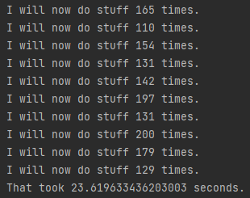

# 08
This branch contains two versions of the same program - a synchronous and an asynchronous one.
The program itself doesn't do anything meaningful, it simply calls ```do_stuff()``` a given number of times,
which in turn calls ```sleep()``` (the number of times ```do_stuff()``` is called is randomized to an extent, however the resulting
difference is not significant enough to cause any issues for the comparison).
The sole purpose is to compare the running time of the two versions.
## The comparison
Below you can find the comparison of the running time of both versions of the program.
Both version will call ```do_stuff()``` 100-200 times.
### sync version

### async version

### Summary
As we can see from the above results, using the asynchronous version results in a ten-fold 
decrease in the running time.
